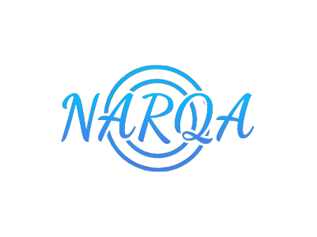

# Narqa Quality Assurance

Narqa Quality Assurance is a project aimed at ensuring adherence to national quality assurance standards. The project provides a comprehensive framework and tools for assessing and monitoring the quality of various products and services in alignment with national requirements.

## Table of Contents

- [Introduction](#introduction)
- [Features](#features)
- [Usage](#usage)
- [Team Members](#team-members)
- [License](#license)

## Introduction

The Narqa Quality Assurance project serves as a centralized platform for organizations to implement and maintain quality assurance practices that comply with national standards. It enables the organization to streamline their quality assurance processes, track performance, and ensure the delivery of high-quality assessment and services.

## Features

- **Standards Compliance**: Narqa offers a comprehensive set of tools and guidelines to help institutes align with national quality assurance standards.
- **Assessment and Monitoring**: The project facilitates the assessment and monitoring of grades and services to ensure they meet the required quality benchmarks.
- **Documentation and Reporting**: Narqa provides features for documenting quality assurance processes and generating comprehensive reports for analysis and compliance purposes.
- **Collaboration and Workflow**: The platform supports collaboration among registered members and enables efficient workflow management for quality assurance activities.
- **Integration and Extensibility**: Narqa can integrate with existing systems and tools, providing flexibility for customization and integration with other quality assurance processes.

## Installation

To install Narqa Quality Assurance, follow these steps:

1. Install dependencies: `npm install`
2. Configure the necessary environment variables.
3. Start the application: `npm run dev`

## Usage

1. Access the Narqa Quality Assurance platform through your preferred web browser.
2. Sign in to your account or create a new one.
3. Explore the various features available within the platform.
4. Follow the provided guidelines and workflows to perform quality assurance assessments and monitoring.
5. Generate reports and analyze the collected data for actionable insights. The Narqa Quality Assurance project automates the process of generating PDF reports, allowing you to efficiently analyze the collected data and derive valuable insights. By leveraging automated report generation, you can easily identify trends, assess performance, and make informed decisions to improve the quality of your products and services.
6. Collaborate with organization members and stakeholders to improve quality assurance practices.

## Team Members

1. Mario George
2. Mohamed Mostafa
3. Ahmed Achraf
4. Ahmed Magdy
5. Farouk Ayman
6. Ahmed hasanen

## License

All rights reserved. This project is proprietary and cannot be used, modified, or distributed without explicit permission from the project owners.Unauthorized use, modification, or distribution may result in legal actions being taken.

We hope that Narqa Quality Assurance helps organizations achieve and maintain national quality assurance standards effectively. If you have any questions or need assistance, please don't hesitate to contact us.
